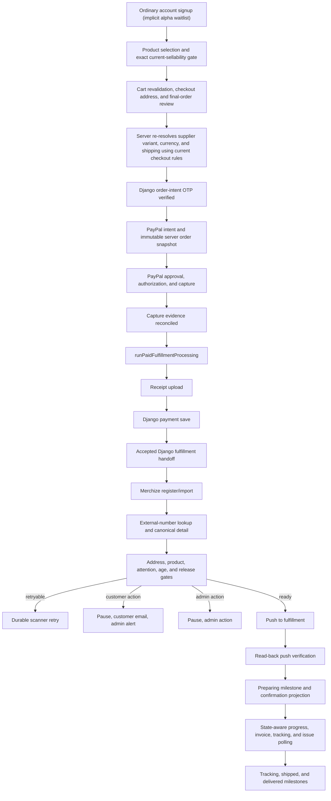

# Shop Alpha Order Flow Release Guide

Last updated: 2026-08-06

Status: **CANONICAL RELEASE PLAN**

This guide is the release-level source of truth for getting the Codex Christi shop from the current
implementation checkpoint to a public alpha in which a real customer can sign up, pay, receive clear
order confirmation, enter fulfillment safely, receive lifecycle updates, and be supported without
payment or provider side effects being replayed.

Every completed Codex Christi account signup is treated as joining the alpha waitlist. "Waitlist" is
a rollout label, not a separate persisted participation state: there is no additional enrollment
record, acknowledgement checkbox, approval step, or user-linking workflow.

The domain guides remain authoritative for their detailed contracts:

- `PAYPAL_TX_LEDGER_GUIDE.md`
- `PAYPAL_WEBHOOK_REGISTRATION_AND_RECOVERY_GUIDE.md`
- `MERCHIZE_FULFILLMENT_OPS_GUIDE.md`
- `ADMIN_RECOVERY_TOOLING_GUIDE.md`
- `SHOP_CHECKOUT_RECOVERY_IMPLEMENTATION_GUIDE.md`

When a domain guide contains an older "next", "imminent", or open-decision section, the priority and
resolved product decisions in this guide take precedence.

---

## 1. Alpha Outcome

The first alpha is public to anyone who completes the ordinary account signup. It is not an
invitation-only buyer program. Preserve the core registration → OTP → login structure. Incremental
auth improvements may be scoped independently, including their own migrations when justified, but
must not be introduced as a waitlist/participation subsystem or divert the release from the
customer-order path. The experience must make alpha status visible without turning signup or
checkout into a test harness:

- a concise, non-blocking alpha notice on the shop homepage;
- a concise, non-blocking alpha notice on the ordinary signup page;
- no admin approval requirement merely to shop;
- no separate alpha checkbox, versioned acknowledgement, participation store, or waitlist
  persistence;
- no test language inside normal payment, fulfillment, or order-status copy;
- no provider jargon exposed to customers.

Alpha is release-ready only when all of the following are true:

1. The server, not the browser cart, owns the amount and line items sent to PayPal.
2. A successful PayPal capture can never be replayed by recovery.
3. An accepted Django fulfillment handoff can never trigger payment-side replay.
4. Every provider push is gated, idempotent, auditable, and verified.
5. Invalid or mismatched addresses stop before push and notify the correct people.
6. Non-US addresses continue without bulk admin intervention when exact provider read-back matches.
7. Customers can securely reopen confirmation across devices.
8. Customers receive the six owned lifecycle messages defined in this guide.
9. Admin can identify the failed stage, data target, customer communication state, and safe next
   action.
10. A scheduled worker can recover transient work and proves that it is healthy.
11. One controlled live order completes from checkout through verified fulfillment and lifecycle
    reconciliation without duplicate payment, duplicate import, or duplicate customer email.

---

## 2. Resolved Product And Architecture Decisions

| Area                    | Alpha decision                                                                                                                                                                                                                                                                              |
| ----------------------- | ------------------------------------------------------------------------------------------------------------------------------------------------------------------------------------------------------------------------------------------------------------------------------------------- |
| Participation           | Every completed ordinary account signup is implicitly part of the alpha waitlist. Do not add a separate enrollment record, acknowledgement, user-linking flow, or invite approval gate.                                                                                                     |
| Alpha disclosure        | Use small informational notices on the signup page and shop homepage. They do not block signup, require dismissal, or create persisted state.                                                                                                                                               |
| Auth evolution          | Preserve the core signup → OTP → login contract. Independently justified auth enhancements are allowed, but they must not be coupled to alpha participation or replace the order-flow priority.                                                                                             |
| Catalog eligibility     | Do not create an arbitrary small hardcoded allowlist. A storefront `all-variants` row proves identity only, not current sellability. A variant may be offered only after exact, unambiguous reconciliation to the current product-line/catalog source, live server price, and current shipping calculation. Storefront and supplier SKU namespaces remain separate. This is an order-integrity check, not a new destination or tax policy. |
| Currency behavior       | Preserve the existing multi-currency checkout and PayPal behavior. P0.2 records the exact server-resolved currency and amounts used for an order; it does not restrict the alpha to USD.                                                                                                    |
| PayPal tax capability   | The current PayPal setup does not provide tax-charging capability. The alpha must not calculate, add, collect, or pass a tax amount or tax line to PayPal.                                                                                                                                  |
| Django scope            | Keep Django at its current boundary: order-intent verification, payment save, and initial Merchize order preparation/handoff. New address, contact, confirmation-access, notification, and lifecycle work is Next.js-owned.                                                                 |
| US addresses            | Merchize `valid` plus exact buyer-details read-back may continue automatically. Explicit invalid states stop before push.                                                                                                                                                                   |
| Non-US addresses        | Merchize US validation does not apply. Provider `other`/`others` plus exact buyer-details read-back may continue automatically, labeled "not provider-validated." No routine admin batch approval is required.                                                                              |
| Customer responsibility | Require a clear pre-payment review of address, size, variant, and quantity. Record a versioned acknowledgement. Do not claim that customer acknowledgement removes statutory rights.                                                                                                        |
| Provider push           | `MERCHIZE_FULFILLMENT_PUSH_ENABLED` must be explicitly configured. Missing or invalid configuration fails closed. Every eligible order must eventually be pushed and verified.                                                                                                              |
| Immediate processing    | Keep the capture-route `after(...)` continuation as the fast first-party trigger when explicitly enabled. Treat it as opportunistic, not durable.                                                                                                                                           |
| Durable recovery        | Keep the scheduled PayPal recovery scanner and lifecycle scanner as the durable fallback. The confirmation status route stays read-only.                                                                                                                                                    |
| PayPal webhooks         | Keep the existing verified PayPal webhook path as a payment-event safety net. This is separate from Merchize webhooks.                                                                                                                                                                      |
| Merchize webhooks       | P1. The first alpha uses synchronous reads plus scheduled polling. Webhooks later accelerate the same durable milestone projection.                                                                                                                                                         |
| Customer email owner    | Codex Christi owns customer order emails. Do not depend on or duplicate unconfirmed Merchize buyer emails.                                                                                                                                                                                  |
| Customer milestones     | Payment received, address action required, preparing, tracking available, shipped, and delivered.                                                                                                                                                                                           |
| Guest confirmation      | Use an emailed, purpose-bound, long-lived viewing capability. Authenticated access also requires matching `userId`. Expiry uses email OTP to issue a new capability.                                                                                                                        |
| Destination scope       | P0.2 does not add, remove, or redefine supported destinations. Preserve current checkout behavior. Any later destination-policy change requires separate product direction and implementation scope.                                                                                        |
| Worldwide scope         | Keep the storefront's current destination coverage during canonical-snapshot work. Missing SKU or reproducible shipping data may stop an individual order as a data-integrity failure, but P0.2 must not invent a geographic block.                                                         |
| Broad provider controls | Refunds, disputes, automatic cancellation, product replacement, arbitrary artwork mutation, and full dashboard parity remain outside alpha scope.                                                                                                                                           |

### What "validated catalog" means

It does not mean choosing a tiny list by hand. Merchize can continue returning storefront variants
after their corresponding supplier variant has been removed. A fresh live comparison confirmed
that behavior, so membership in the storefront `all-variants` response is only identity evidence.
It is not positive availability evidence.

The server must prove all of this for the selected variant:

- the product and variant are active;
- the storefront product ID, variant ID, storefront SKU, title, and options resolve as seller-store
  identity without being treated as supplier identity;
- when the storefront variant has a `Product` option, its product-line name plus the complete
  normalized non-Product option map resolves to exactly one variant in the current product-line
  response; that result owns the supplier product/variant identity and supplier SKU;
- when the storefront variant has no `Product` option, the supplier-facing SKU used by that path is
  an exact member of a completed current supplier-catalog generation, not a partial page or stale
  local snapshot;
- storefront and supplier SKUs are kept in separate fields/namespaces. They may differ and must not
  be equated, copied over one another, or used as an implicit fallback;
- missing, ambiguous, fuzzy/nearest-option, incomplete, or unverified reconciliation fails closed;
- the quantity is valid;
- the current server price is available in the checkout currency under the existing multi-currency
  behavior;
- the current shipping calculation can be reproduced from trusted supplier-SKU/catalog data without an
  unsafe flat fallback;
- the checkout snapshot can be reproduced later for receipt and fulfillment reconciliation.

The same current-sellability verdict must fail closed at public variant display, add-to-cart, cart
hydration/revalidation, quantity increase, checkout entry, direct checkout, and PayPal intent
creation. Compatibility reads have a 15-second timeout. A timed-out, failed, or incomplete provider
read is `unverified`, never positive availability evidence. A stale cart row remains visible so the
customer can remove it (or reduce its quantity), but it cannot be increased, checked out, silently
substituted, or deferred for post-payment adjustment.

Sellability and canonical-order reads for the base product, `all-variants`, and current price are
strict `no-store` provider reads; the durable storefront snapshot is display fallback only and must
never become positive availability evidence. The supplier product ID, supplier variant ID, and SKU
from the exact product-line proof must all equal the completed catalog row before snapshot creation.
Strict catalog reads require both the variant and parent product to belong to
`SyncState.lastCompletedRunId`; catalog write batches and generation finalization are fenced by the
same database lease transaction so a superseded refresh cannot become checkout proof.

Only confirmed drift or unavailability from complete current evidence creates or updates a
per-variant catalog-data-health incident. Its evidence includes the storefront product/variant IDs,
title, storefront SKU, complete selected options and `Product` option when present, attempted current
supplier mapping/IDs/SKU, failure reason, source/generation timestamps, occurrence count, first/last
seen, and the safe manual action: update the storefront variant to a current product-line item or
remove it. Transient provider failures, timeouts, and incomplete or otherwise unverified evidence
remain aggregate operational health and must not fan out into per-variant incidents or one email per
customer attempt. Confirmed incidents accumulate in the persistent Storefront Data Health admin
queue. P0.2 does not add a catalog email/outbox path; outbound escalation belongs to the separately
scoped notification phase if it is later required.

`/admin/shop/storefront-data-health` shows only compact incident counts so catalog statistics and
SKU lookup remain immediately reachable. The detailed, mobile-first disclosure queue lives at
`/admin/shop/storefront-data-health/variant-publication-issues`; each issue stays collapsed until an
admin opens its IDs, supplier evidence, and manual repair instruction.

---

## 3. Current Codebase Checkpoint

### Implemented and retained

- The PayPal TX ledger owns capture evidence, receipt generation/upload, Django payment save, and
  the Django `/orders/process/{custom_id}` handoff.
- `runPaidFulfillmentProcessing(orderToken)` is the canonical parent orchestrator.
- A Django `200` or `201` response with `success = true`,
  `data.processing_status = "completed"`, and
  `error_message = "Order created but details not available"` is accepted.
- Accepted Django rows continue at Merchize registration/lookup/readiness/push. They do not replay
  capture, receipt generation, Django payment save, or the accepted handoff.
- The PayPal ledger and Merchize Fulfillment Ops database use one `SHOP_OPS_DATA_TARGET`.
- Local production mutation requires explicit opt-in, master-admin confirmation, and an audit
  reason.
- Merchize registration, external-number lookup, detail sync, normalized snapshots, readiness
  checks, push, push verification, admin notifications, customer preparing email, and admin recovery
  controls exist.
- The confirmation status route is read-only.
- A scheduled route runs payment recovery and post-push lifecycle reconciliation.
- Admin and customer outbox rows are durable and manually resendable in implemented recovery
  surfaces.
- The existing Django-backed signup, OTP verification, and login structure remains the account
  entry path.
- Signup and shop-home alpha notices are informational only. Completing ordinary signup is the
  product-level definition of joining the alpha waitlist.

### P0.2 correction checkpoint — locally complete, deployment pending

- P0.2 extends the existing `PaypalIntent` ledger. It does not create a standalone order database,
  new payment table, or alpha-participation store.
- The ledger intent route accepts browser product/variant/quantity selections only as lookup
  selectors. Product relationships, SKUs, current prices, currency, and shipping are resolved from
  trusted server/provider data before the PayPal order is created.
- Product publication and storefront variant identity are checked from trusted Merchize responses,
  but `all-variants` membership is not current sellability proof. A product-line/options match is
  provisional until its supplier product ID, supplier variant ID, and SKU also match one row in the
  latest completed catalog generation; variants without a Product option require exact current-
  catalog SKU membership. This dual-source proof is enforced at public variant display, add-to-cart,
  stale-cart revalidation, quantity increase, checkout, direct checkout, and PayPal intent creation.
  Compatibility reads time out after 15 seconds and fail closed as `unverified`.
  Explicit inactive/deleted/private/taken-down/hidden/draft/retired/unapproved state remains an
  immediate block.
- Public selector work is bounded to 25 selector rows, 128 characters per identifier, 25 units per
  merged line, and 100 total units. Duplicate selectors are merged and rechecked; each unique
  product resolves once with at most four concurrent workers, then catalog SKUs resolve in one
  strict batch.
- Admin/scheduled published-variant audits may cover more than 100 discovered products, but each
  underlying scan remains bounded to 100 products and four product workers. The orchestration layer
  globally trims, dedupes, and sorts IDs, awaits deterministic chunks sequentially, and aggregates
  every chunk's counts, results, and product errors.
- Missing, ambiguous, or unverified current supplier mapping, SKU data, provider-catalog mismatch,
  unsafe shipping fallback, and invalid shipping quotes must stop before cart admission and remain
  blocked at intent creation. Storefront and supplier SKU namespaces must not be collapsed.
- New rows persist an immutable, versioned, SHA-256-hashed canonical order snapshot plus matching
  external version/hash metadata. A database constraint requires all three fields to be either
  populated together or null together.
- PayPal purchase-unit line items, subtotal, shipping, currency, and total are built only from the
  canonical snapshot. No tax field or tax line is present.
- Authorization and capture must each exactly match the canonical total and currency. The shared
  full-chain gate is used by capture/webhook recovery, payment reconciliation, scanners, the
  fulfillment runner, and mutating admin recovery actions, so a later matching capture cannot hide
  an earlier authorization mismatch.
- Authorization-route, capture-route, webhook, and payment-reconciliation transitions re-read the
  latest ledger row and commit with an optimistic compare-and-swap. Concurrent or delayed signed
  authorization/capture mismatches remain incidents across later contradictory evidence; stale
  pending, missing-reference, and route-timeout results cannot replace completed evidence or move
  post-capture state backward, and fulfillment resumes only after the guarded transition commits.
- `runPaidFulfillmentProcessing` repeats the full authorization-plus-capture reconciliation before
  either full or fulfillment-only side effects. Canonical receipts, Django payment-save amount,
  and fulfillment items use the same snapshot.
- Pre-P0.2 rows remain compatible only when snapshot, version, and hash are all null. Partial or
  corrupt canonical metadata fails closed and never falls back to browser cart data.
- Customer/admin recovery summaries and Merchize Ops registration prefer a valid canonical
  snapshot; raw-cart display/mapping remains only for the all-null legacy envelope. A recovery
  label describing money paid always shows the actual completed PayPal capture, never the expected
  canonical total; any difference is surfaced for review.

The current-sellability implementation is locally complete. An additive local SQLite `db push` was
completed, followed by a complete current-catalog generation covering 905 products and 19,885
variants. The pre-final live baseline audit found 141 variants across 13 products: 138 available, 3
confirmed unavailable, and 0 unverified. The final dual-source catalog cross-check is covered by six
focused regressions, and the full local suite passed 195/195 tests, along with TypeScript, targeted
ESLint, the production webpack build, and diff checks. A repeat live audit under the final gate and
deployed sandbox/E2E evidence remain pending. The repair run did not send a notification email. No
PayPal ledger migration was deployed.

Deployment remains gated. The apparent development history-name divergence was a lost legitimate
migration file, not a replacement for the checked-in webhook-binding migration. Development has
both `20260622190000_add_paypal_ledger_transaction_webhook_bindings` and the later
`20260622190331_add_paypal_ledger_transaction_webhook_bindings` recorded successfully. The latter
renames PostgreSQL's truncated `...paypalPaymentMode_isActiv` index to Prisma's expected
`...paypalPaymentMode_isA_idx`; its exact SQL has been restored to this repository with SHA-256
`2356add3eeef5a0e2c45d179244f99c262c4658590beb55116243f0c7787df3e`.

Do not edit either applied migration, delete or rename `_prisma_migrations` rows, reset a configured
ledger, or use `migrate resolve` for this repair. The restored 13-migration chain passes on
disposable PostgreSQL. Read-only status confirms that development has only
`20260806000000_add_canonical_order_snapshot` pending, while production stops first at the restored
index rename. The next move is explicit database approval for `prisma migrate deploy` against
development. The restored rename is already recorded there, so only the canonical-snapshot
migration should apply. Production's later reviewed rollout must apply and verify the index rename,
recheck status, then apply the canonical-snapshot migration. Deployed development sandbox/E2E
verification must pass before production rollout or any P0.2 release gate is checked. P0.3 then
begins as a read-only destination-behavior trace.

### Remaining verified alpha gaps

- `MERCHIZE_FULFILLMENT_PUSH_ENABLED` currently treats a missing value as enabled. Alpha must change
  this to required explicit configuration.
- The public confirmation status route can be read with possession of `orderToken`; there is no
  purpose-bound cross-device viewing grant.
- Only the preparing/push-verified customer email is implemented. The other five lifecycle messages
  are not complete.
- Most footer policy links are placeholders. The existing Shipping and POD policy overstates some
  exclusions and needs jurisdiction-safe exception language.
- The scheduled route does not persist a heartbeat, and it does not yet act as one bounded global
  dispatcher for every pending customer/admin outbox row.
- Lifecycle reconciliation performs too many per-order provider requests and lacks the documented
  batch/state-aware request budget.

---

## 4. Non-Negotiable Safety Invariants

### Payment

- Never authorize or capture from a scanner, webhook recovery handler, admin fulfillment action, or
  confirmation status route.
- Use a stable PayPal request id derived from `orderToken`.
- Reconcile persisted authorization and completed-capture amount/currency against the immutable
  server order snapshot.
- An authorization or capture mismatch is a money-risk admin incident. Do not push fulfillment.
- The current PayPal setup cannot charge tax. The canonical snapshot, PayPal purchase unit, and
  receipt totals contain merchandise and shipping only; do not add or describe any amount as tax
  collected.

### Django

- `djangoPaymentSaveCustomId` is the `/orders/process/{custom_id}` path value.
- Once payment save is durable, fulfillment-only retry cannot call it again.
- Once the Django fulfillment handoff is accepted, fulfillment-only retry cannot call the handoff
  again.
- The informational accepted `201` contract is success, not failure.

### Merchize identifiers

- `orderToken`: local support/customer reference.
- `djangoPaymentSaveCustomId`: Django process path value.
- `merchizeExternalOrderNumber`: `ORD-...` external number returned through the accepted Django
  response.
- `merchizeOrderId`: `resp.data._id` from external-number lookup.
- Never use the wrapped Django `response_data.data._id` as the actionable Merchize order id.

### Fulfillment

- Keep Merchize operations separate from PayPal retry logic.
- Registration/import, lookup, readiness, push, and push verification are individually resumable.
- A push timeout is ambiguous. Read back provider state before another push attempt.
- Do not treat a successful HTTP push response alone as verified release.
- A blocker cannot reach `POST /order/external/orders/push`.
- Read-only admin page loads never call provider mutation or create sync-attempt rows.

### Notifications

- A webhook, poller, or runner records a normalized milestone; it does not send mail directly.
- Milestone persistence and outbox enqueue are one durable operation where database ownership
  permits it.
- Every event has a stable dedupe key.
- Mail failure never rolls a fulfillment milestone backward.
- Customer messages contain no raw provider payload, internal ids, stack traces, or admin URLs.

---

## 5. Target Flow



The capture-route `after(...)`, PayPal webhook, scheduled recovery scanner, and admin resume can all
request the same orchestrator. The PayPal processing lease and stage checkpoints determine whether
work actually runs.

---

## 6. P0 Implementation Order

Do these in order. Do not start P1 Merchize webhooks before the P0 release gates pass.

### P0.1 Preserve signup and add lightweight alpha disclosure

1. Keep the core registration, OTP verification, and login architecture unchanged. Separately
   scoped auth hardening is allowed when it preserves this contract and is not coupled to alpha
   participation.
2. Treat every successfully completed ordinary account signup as implicitly joining the alpha
   waitlist. This is a rollout assumption, not a new database entity or account flag.
3. A "Join waitlist" marketing CTA may link directly to the ordinary signup route; it does not need
   a waitlist query parameter or alternate registration branch.
4. Show a small informational notice on the ordinary signup page.
5. Show a small informational notice on the shop homepage.
6. Explain that the shop is in alpha and some features may change or not work fully. On the shop
   notice, also make clear that submitted orders are real and made to order.
7. Do not add a waitlist query-state pipeline, blocking checkbox, dismissible/versioned dialog,
   participation API, dedicated store, duplicate reconciliation, or user-linking workflow.
8. The final checkout address/selection acknowledgement in P0.4 remains a separate, stronger event
   because it applies to a real order.

### P0.2 Create one canonical server order snapshot

Correction checkpoint: the snapshot/payment foundation and current-sellability code are locally
complete. Local SQLite received the additive compatibility data and a complete 905-product/
19,885-variant generation was built. A pre-final 13-product live baseline returned 141 total/138
available/3 unavailable/0 unverified; the completed dual-source gate now has focused regression
coverage and the 195-test suite plus type/lint/build checks pass. Repeat the live audit under the
final gate before development PayPal migration deployment and deployed sandbox/E2E verification.
The following remains the acceptance contract.

1. Resolve every storefront product and variant from trusted server data. Treat `all-variants`
   membership as identity input only. Reject explicit inactive/private/deleted/taken-down/unapproved
   product state and explicit inactive/hidden/deleted/draft/retired variant state.
2. Prove current supplier sellability exactly and without substitution:
   - with a `Product` option, require exactly one current product-line variant whose line name and
     complete normalized non-Product option map match, then require that preset's supplier product
     ID, supplier variant ID, and SKU to match one row in the latest completed catalog generation;
   - without a `Product` option, require exact current SKU membership from a completed supplier-
     catalog generation;
   - keep storefront IDs/SKU and supplier IDs/SKU in separate namespaces;
   - fail closed on missing, ambiguous, fuzzy, partial, stale, or unavailable evidence.
3. Bound compatibility reads to 15 seconds and use the same fail-closed verdict at public variant
   display, add-to-cart, cart hydration/revalidation, quantity increase, checkout entry, direct
   checkout, and PayPal intent creation. Keep stale rows visible/removable, but never defer an
   unavailable-variant correction until after authorization or capture.
4. Create/update a per-variant catalog-data-health incident only for confirmed drift or
   unavailability, with the storefront identity/options, attempted supplier mapping, evidence
   source/timestamps, failure reason, occurrence history, and the safe manual action. Provider
   timeouts, outages, incomplete reads, and other unverified evidence stay aggregate and do not
   create an incident flood. Accumulate confirmed incidents in the Storefront Data Health admin
   queue. Keep every open incident reachable through server-side pagination and never present a
   storage failure as a zero-issue state. Do not create a PayPal notification-outbox row, send
   catalog email, emit one alert per click, or create a PayPal intent for the failure.
5. Resolve current unit price and currency server-side while preserving the existing multi-currency
   checkout and PayPal behavior. Do not introduce an alpha-wide USD restriction.
6. Recalculate shipping from trusted supplier SKU/provider/catalog data using the destination behavior
   already implemented by checkout. This is order-data verification, not a new destination policy.
7. Reject missing supplier SKU rows or unsafe shipping fallbacks.
   Bound selector size, line/total quantity, selection count, and provider-request concurrency.
8. Persist an immutable snapshot containing:
   - storefront product/variant identifiers and storefront SKU;
   - resolved supplier product-line/product/variant identifiers and supplier SKU;
   - title and selected options;
   - quantity;
   - server unit price;
   - shipping allocation;
   - currency;
   - subtotal, shipping, and total;
   - destination country/region;
   - snapshot version and hash.
9. Build PayPal purchase units and line items only from this snapshot.
10. Compare both authorization and capture amount/currency to the snapshot before fulfillment. Keep
   the complete chain enforced in webhook, reconciliation, scanner, runner, and admin mutation
   paths.
11. Generate the receipt from the same snapshot, not from mutable browser state.
12. Do not add or remove supported destinations as part of this phase.
13. Do not calculate, add, collect, or pass tax through PayPal. The canonical monetary snapshot,
    PayPal purchase unit, and receipt use merchandise plus shipping only and contain no tax amount
    or tax line.
14. In recovery UI, canonical lines/destination describe the expected order, while any value labeled
    paid comes from actual completed PayPal capture evidence. A difference triggers review and
    disables fulfillment/retry; never relabel the expected total as paid.

### P0.3 Document current destination behavior without changing it

1. This is a non-authorizing audit item. It does not approve a destination-policy change.
2. Keep the work read-only: document and trace current behavior; do not change application code,
   configuration, datasets, migrations, provider-account settings, or customer-facing policy.
3. Document the current checkout behavior, data sources, and known limitations.
4. Verify that P0.2 preserves the existing destination coverage, currencies, and customer copy.
5. Do not infer new allowed or blocked destinations from provider documentation.
6. PayPal tax charging remains unavailable and outside this phase. Provider IOSS or tax-display
   metadata is read-only operational evidence and does not authorize or supply a PayPal tax charge.
7. Any proposed destination-policy change requires separate product approval, acceptance criteria,
   customer copy, tests, and rollout planning outside P0.2. Tax support is outside this release
   guide and must not be implemented without explicit new direction after the required PayPal
   capability exists.

### P0.4 Make final-order acknowledgement real

Before PayPal controls become active, show the exact:

- recipient;
- fulfillment contact email;
- address;
- product/variant;
- size;
- color/design;
- quantity;
- final server total.

Require a checkbox such as:

> I reviewed the delivery address and made-to-order selections shown above.

Persist:

- policy version;
- acknowledgement timestamp;
- checkout surface;
- user id when present;
- a PII-safe fingerprint of the rendered address and selection snapshot.

Do not put a disruptive modal on every checkout. Use the inline gate, with a modal only when a user
attempts to pay without acknowledging or when PayPal returns a materially different address.

### P0.5 Secure confirmation and cross-device recovery

Authenticated customer:

- Require session `userId` to match the order owner.
- Permit an emailed capability as a recovery path when session ownership is unavailable.

Guest customer:

- Email a high-entropy, purpose-bound viewing capability after payment evidence is durable.
- Do not place email, address, PayPal id, or provider id in the URL.
- Recommended initial lifetime: 90 days.
- Include purpose, `orderToken`, issued-at, expiry, and token version in the signature.
- Store enough server state to rotate/revoke the capability.
- When expired or absent, verify the checkout email with the existing OTP pattern and issue a new
  viewing capability.

All confirmation reads:

- return a customer-safe projection, not the raw ledger row;
- mask contact/address fields by default;
- never return raw `lastErrorMessage`;
- distinguish payment received, fulfillment delayed, customer action required, preparing,
  tracking, shipped, delivered, cancelled, and refunded;
- keep all mutations behind OTP or authenticated step-up.

The current raw `orderToken` status endpoint must reject requests without authenticated ownership or
a valid viewing capability once this phase ships.

### P0.6 Complete pre-push readiness and address policy

Use the following automatic policy:

| Condition                                                                              | Result                                                                |
| -------------------------------------------------------------------------------------- | --------------------------------------------------------------------- |
| US `valid`, exact provider read-back, products ready, no attention, age gate clear     | Push automatically                                                    |
| Non-US `other`/`others`, exact read-back, products ready, no attention, age gate clear | Push automatically and label not provider-validated                   |
| US explicit invalid status                                                             | Pause, customer address email, admin alert                            |
| Provider/ledger address mismatch                                                       | Pause, customer correction email, admin alert                         |
| Validation pending or provider indexing lag                                            | Retry with bounded backoff; alert only after threshold                |
| Product/template mapping missing                                                       | Pause for admin; do not ask customer to solve provider mapping        |
| Required artwork missing for an artwork-set order                                      | Pause for admin                                                       |
| Template/catalog order with a mapped SKU and no standalone artwork fields              | Do not invent an artwork blocker                                      |
| Provider issue/attention blocker                                                       | Pause and alert admin                                                 |
| Order older than provider automatic-release window                                     | Require audited manual release after all other gates pass             |
| Push disabled by config                                                                | Record paused state and alert admin; never report fulfillment success |

Address correction sequence:

1. Verify customer or master admin.
2. Save a separate effective fulfillment address; preserve original payment evidence.
3. Update Merchize buyer details through the server-only adapter.
4. Read buyer details back from Merchize.
5. Require exact normalized match.
6. Re-read validation state.
7. Regenerate/update customer-facing receipt evidence where the current receipt is intended to show
   the effective fulfillment address.
8. Continue automatically for US `valid` or non-US `other`/`others`.
9. A still-invalid US address requires master-admin mark-valid and release with reason.

### P0.7 Make push policy fail closed

Change `MERCHIZE_FULFILLMENT_PUSH_ENABLED` behavior:

- `true`: eligible orders may push.
- `false`: registration/readiness may run, push is paused, admin is notified.
- missing/blank/invalid: configuration error; do not push.

Production deploy must set the value explicitly. A manual override requires:

- master-admin step-up;
- reason;
- visible data-target badge;
- exact order reference;
- re-run of all current readiness checks;
- audit record;
- push acknowledgement and independent read-back verification.

### P0.8 Complete customer and admin notifications

Customer milestones:

| Milestone               | Trigger                                                   | Dedupe key                                           |
| ----------------------- | --------------------------------------------------------- | ---------------------------------------------------- |
| Payment received        | Reconciled successful capture                             | `payment_received:{orderToken}`                      |
| Address action required | Durable customer-action blocker                           | `address_action:{orderToken}:{blockerVersion}`       |
| Preparing               | Push independently verified                               | `preparing:{orderToken}`                             |
| Tracking available      | First usable package tracking number/URL                  | `tracking:{orderToken}:{packageId}:{trackingNumber}` |
| Shipped                 | First durable shipped transition per package/order policy | `shipped:{orderToken}:{packageId}`                   |
| Delivered               | Durable delivered transition                              | `delivered:{orderToken}`                             |

Rules:

- A tracking refresh with no new customer-visible milestone does not enqueue email.
- Multi-package orders may send one tracking message per package, but one order must not send
  repeated identical shipment notices.
- Failed email remains in outbox with bounded retry and manual resend.
- Customer action email links to the secure confirmation/correction capability, not admin.
- Payment received can be sent before provider push; preparing only after verified push.

Admin notifications:

- money mismatch or uncertain capture;
- receipt/Django stage failure after payment;
- explicit address blocker or provider read-back mismatch;
- product/template/artwork/attention blocker;
- age/manual-release gate;
- push disabled;
- ambiguous or failed push verification;
- repeated lifecycle sync failure;
- customer email retry exhaustion;
- scanner/outbox heartbeat stale.

### P0.9 Harden scheduled processing and request budgets

The existing authenticated scheduled route remains the orchestrator for:

- stuck post-payment recovery;
- post-push lifecycle reconciliation;
- bounded customer/admin outbox dispatch;
- scheduler heartbeat.

Add:

- one persisted run row with start, finish, target, counts, status, and redacted error;
- overlap prevention;
- per-stage retry and maximum attempt policy;
- one global pending-outbox batch, not only per-order incidental sends;
- admin health summary showing last success and last failure.

Provider request policy:

- use batch endpoints whenever contract-tested;
- do not fetch tickets/history on every healthy scan;
- do not refetch immutable canonical detail after the order is terminal;
- use increasing intervals as the order ages;
- stop normal polling at delivered/cancelled terminal state;
- allow an explicit admin refresh without changing the normal schedule.

### P0.10 Add the customer lifecycle projection

Persist and expose normalized state:

- payment received;
- provider order registered;
- action required;
- preparing;
- in production;
- shipment started;
- tracking available;
- delivered;
- cancelled/refunded where applicable.

The customer page should show:

- support reference;
- paid total/currency;
- receipt;
- current plain-language state;
- last meaningful update;
- package tracking when available;
- required customer action;
- no raw provider ids or internal error codes.

---

## 7. Merchize Synchronous Endpoint Plan

Use the server-only adapter and `X-API-KEY` for routes already proven to accept the stable API key.
Never expose the key to the browser. Contract-test each route against a non-customer fixture before
making it an automatic production dependency.

### Official external-order endpoints

| Stage                | Method and endpoint                                | Use                                                                    | Normal cadence                            |
| -------------------- | -------------------------------------------------- | ---------------------------------------------------------------------- | ----------------------------------------- |
| Import catalog order | `POST /order/external/orders/catalog`              | Register the accepted Django/provider order when this path owns import | Once/idempotent                           |
| Canonical detail     | `GET /order/external/orders/order-detail`          | External-number lookup and detail                                      | Registration/readiness, then exceptions   |
| Batch detail         | `POST /order/external/orders/list-orders-detail`   | Reconcile multiple rows                                                | Batch scanner                             |
| Push                 | `POST /order/external/orders/push`                 | Release one ready order                                                | Once, then verify                         |
| Hold/resume          | `POST /order/external/orders/update-order-status`  | Guarded admin provider control                                         | Manual only for alpha                     |
| Cancel               | `POST /order/external/orders/cancel`               | Provider cancellation                                                  | Deferred, not an automatic alpha action   |
| Progress             | `GET /order/external/orders/order-progress`        | Production and delivery milestones                                     | State-aware polling                       |
| Batch progress       | `POST /order/external/orders/list-orders-progress` | Efficient lifecycle polling                                            | Preferred after contract test             |
| Tracking             | `GET /order/external/orders/tracking`              | Package/tracking snapshot                                              | After shipment-related progress           |
| Batch tracking       | `POST /order/external/orders/list-orders-tracking` | Efficient tracking refresh                                             | Preferred for shipping rows               |
| Invoice              | `GET /order/external/orders/order-invoice`         | Fulfillment cost/payment snapshot                                      | After push and when invoice should mature |
| Batch invoice        | `POST /order/external/orders/list-orders-invoice`  | Efficient cost reconciliation                                          | Periodic/admin                            |
| Tickets              | `POST /order/external/orders/list-orders-ticket`   | Issue/support evidence                                                 | Exception/admin refresh                   |
| Artwork-set import   | `POST /order/import/artworks`                      | Orders explicitly created from artwork sets                            | Only for that order type                  |

Identifier preference:

1. use provider `code` when known;
2. otherwise use `external_number = merchizeExternalOrderNumber`;
3. include `identifier` only when required to disambiguate duplicate external numbers.

The documented batch progress response appears inconsistent with its request description. Do not
depend on it in production until a fixture contract test proves its actual shape. Fall back to the
single-order progress endpoint when the batch response is ambiguous.

### Address and diagnostic routes

The following provider dashboard routes are already represented in the adapter but are not all part
of the public external-order documentation:

| Method and endpoint                                            | Purpose                                               |
| -------------------------------------------------------------- | ----------------------------------------------------- |
| `GET /order/orders/{merchizeOrderId}`                          | In-depth order, validation status, and provider flags |
| `GET /order/orders/{merchizeOrderId}/buyerdetails`             | Exact stored buyer-detail read-back                   |
| `POST /order/orders/{merchizeOrderId}/buyerdetails`            | Correct address/contact in Merchize                   |
| `GET /order/orders/{merchizeOrderId}/address-suggestion`       | Provider suggestion evidence                          |
| `POST /order/orders/{merchizeOrderId}/mark-valid-address`      | Master-admin address override                         |
| `GET /order/orders/{merchizeOrderId}/histories`                | Provider history evidence                             |
| `GET /order/get-order-progress/{merchizeOrderId}`              | Dashboard progress detail                             |
| `GET /order/orders/{merchizeOrderId}/require-attention`        | Provider attention evidence                           |
| `GET /order/orders/{merchizeOrderId}/send-to-fulfillment-date` | Age/manual-release evidence                           |

Policy:

- server-only;
- API-key authentication only after explicit contract proof;
- redact request/response logging;
- no automatic worker around a route that requires dashboard/session auth;
- address mutation requires read-back;
- mark-valid is master-admin only;
- internal endpoint failure cannot be reinterpreted as a valid address.

### State-aware polling profiles

| Provider state                     | Calls                                                    |
| ---------------------------------- | -------------------------------------------------------- |
| Registered, pre-push               | Detail/readiness only                                    |
| Push verified, awaiting production | Batch progress; invoice only when due                    |
| In production                      | Batch progress; tracking only after shipment signal      |
| Shipment started                   | Tracking at a bounded interval; progress less frequently |
| Delivered                          | One terminal reconciliation, then stop                   |
| Attention/exception                | Detail plus targeted ticket/history/attention evidence   |

---

## 8. P1 Merchize Webhook Plan

Merchize webhooks are not required for the minimum synchronous alpha. They are an acceleration and
reconciliation layer after P0 is stable.

The current integration UI exposes registration, simulator, delivery logs, enable/disable, endpoint,
event selection, and a separate secret-key control. No registered webhook rows were visible during
the 2026-07-27 inspection. Secret values were not read or copied.

Documented event types:

1. `ORDER.CREATED`
2. `ORDER.CHANGED.TRACKING`
3. `ORDER.CHANGED.SHIPMENT`
4. `ORDER.CHANGED.PROGRESS`
5. `ORDER.CHANGED.PROGRESS_STATUS`
6. `ORDER.PAYMENT.TRANSACTION_FEE`
7. `ORDER.PAYMENT.FULFILLMENT_COST`
8. `ORDER.PAYMENT.FULFILLMENT_COST_PAID`
9. `ORDER.PAYMENT.REFUND`
10. `ORDER.PAYMENT.SURCHARGE`
11. `ORDER.ISSUE.UPDATED`
12. `ORDER.INVALID.ADDRESS`
13. `ORDER.IMPORTER.ERROR`

The registration UI showed 12 selectable events and did not visibly include
`ORDER.CHANGED.PROGRESS_STATUS`. Treat that mismatch as a provider contract question, not an
invented event subscription.

P1 implementation:

1. Manually register one stable HTTPS endpoint in the Merchize integration UI.
2. Store the provider secret server-side.
3. Verify the raw request before JSON normalization.
4. Persist an immutable delivery with provider event id/hash, event type, received time, signature
   status, correlation result, and redacted processing result.
5. ACK duplicates idempotently.
6. Correlate using provider order id/code and external number; never guess by customer PII.
7. Project the event into the same normalized milestone tables used by polling.
8. Enqueue outbox rows from the normalized milestone, never directly from the HTTP handler.
9. Keep polling as gap repair for missed, delayed, unsupported, or malformed webhook deliveries.
10. Add simulator fixtures with fake PII only.

Priority subscriptions:

- `ORDER.INVALID.ADDRESS`
- `ORDER.IMPORTER.ERROR`
- `ORDER.ISSUE.UPDATED`
- `ORDER.CHANGED.PROGRESS`
- `ORDER.CHANGED.SHIPMENT`
- `ORDER.CHANGED.TRACKING`
- `ORDER.CREATED`

Payment/cost events are admin reconciliation signals. They do not change PayPal payment truth.

---

## 9. Data Changes Required

Exact model ownership should follow the existing database boundaries, but the release needs these
durable concepts:

### Signup and alpha disclosure

No new user/account or alpha-enrollment data model is required. Ordinary successful signup is
implicitly considered waitlist participation for rollout purposes. The signup and shop-home notices
are static informational UI and do not create acknowledgement or preference state.

### PayPal TX ledger

- immutable canonical server order snapshot and hash;
- captured amount/currency reconciliation result;
- checkout policy version and acknowledgement;
- address/selection fingerprint;
- order-view capability version/revocation state;
- original payment email remains immutable;
- verified `fulfillmentContactEmailOverride` remains separate.

### Merchize Fulfillment Ops

- normalized provider order/item snapshots;
- address validation scope/status and exact read-back result;
- production gate evidence;
- push acknowledgement and independent verification;
- package progress/tracking;
- invoice/cost snapshots;
- issue/ticket summaries;
- next scheduled sync time and terminal state.

### Admin Ops or generic job ledger

- scheduled-run heartbeat;
- outbox-dispatch run;
- admin mutation audit;
- alert recipient configuration and delivery history.

Do not add cross-database foreign keys. Use indexed correlation keys:

- `orderToken`;
- `djangoPaymentSaveCustomId`;
- `merchizeExternalOrderNumber`;
- `merchizeOrderId`;
- PayPal order/capture ids where applicable.

---

## 10. Admin Alpha Operations

The paid-order recovery detail should answer, without loading raw JSON by default:

- Is payment captured and reconciled?
- Is receipt durable?
- Is Django payment save complete?
- Was the Django fulfillment handoff accepted?
- Was the provider order found?
- Does provider address exactly match the effective ledger address?
- Is validation `valid`, explicit invalid, pending, or non-US/not validated?
- Are products/template mappings ready?
- Is standalone artwork actually required for this order type?
- Is provider attention present?
- Is the order past the automatic-release age?
- Was push acknowledged and independently verified?
- What customer/admin notifications were enqueued, sent, failed, resent, or suppressed?
- What is the safe next action?

High-risk controls:

- correct address/contact;
- mark address valid;
- release an age-gated order;
- override push-disabled configuration;
- hold/resume;
- future cancel/refund.

All require reason capture, audit, target display, and appropriate step-up. Master-only actions cannot
be delegated merely by showing the button to another admin.

Add operational views for:

- scanner and outbox heartbeat;
- pending customer action;
- pending admin action;
- repeated provider sync failures;
- tracking email failures;
- production data accessed from non-production runtime.

---

## 11. Customer Policy And Copy Requirements

Create real linked pages for:

- Terms of Use;
- Privacy and Security;
- Refund/Returns and Made-to-Order Policy;
- Shipping and POD Policy;
- Payment Protection.

The terms, refund, and shipping pages should explain:

- made-to-order production begins quickly;
- customer-selected size, color, design, quantity, and delivery address must be reviewed;
- buyer-error returns/reships may not be available;
- address changes may become impossible after production;
- international recipients may owe import duties where not prepaid;
- supported destinations can change;
- defective, damaged, misdescribed, or incorrectly fulfilled orders retain applicable remedies;
- nothing in the policy removes non-waivable consumer rights.

Privacy should explain only data handling, including payment/provider sharing, operational email,
retention, and order-access links. Do not place return exclusions in the privacy policy.

Before release, policy copy should receive jurisdiction-aware review. This guide is an engineering
contract, not legal advice.

Provider references:

- [Merchize US address validation](https://merchize.com/helpdesk/verify-us-shipping-address/)
- [Merchize shipping countries](https://merchize.com/helpdesk/shipping-countries/)
- [Merchize API documents](https://seller.merchize.com/a/api-documents)

---

## 12. Environment Contract

Do not store values in this guide. Required names are grouped by ownership.

### Release and origins

```bash
NEXT_PUBLIC_SITE_URL=
NEXT_PUBLIC_SHOP_SITE_URL=
```

### Shop Ops target

```bash
SHOP_OPS_DATA_TARGET=prod
SHOP_OPS_ALLOW_LOCAL_PRODUCTION_MUTATIONS=false
```

### PayPal

```bash
PAYPAL_PAYMENT_MODE=live
PAYPAL_TX_LEDGER_ENABLE_CAPTURE_ROUTE_RUNNER=true
PAYPAL_TX_LEDGER_RECOVERY_SCANNER_ENABLED=true
PAYPAL_TX_LEDGER_RECOVERY_SCANNER_MIN_AGE_MINUTES=
PAYPAL_TX_LEDGER_RECOVERY_SCANNER_BATCH_SIZE=
PAYPAL_TX_LEDGER_RECOVERY_SCANNER_SECRET=
PAYPAL_WEBHOOK_SIGNATURE_VERIFICATION=required
```

Use the existing mode-specific PayPal credentials and webhook ids. Never put server secrets in
`NEXT_PUBLIC_*`.

### Merchize

```bash
MERCHIZE_API_KEY=
MERCHIZE_BASE_URL=
MERCHIZE_STORE_ID=
MERCHIZE_FULFILLMENT_PUSH_ENABLED=true
```

`MERCHIZE_ACCESS_TOKEN`/`MERCHIZE_TOKEN` are not the preferred automatic-worker credential when the
stable API key supports the required endpoint.

### Databases

```bash
PAYPAL_TX_LEDGER_NEON_POOLED_DB_STRING=
MERCHIZE_FULFILLMENT_OPS_NEON_POOLED_DB_STRING=
```

Keep dev equivalents in development only. Admin Ops configuration remains in its existing section.

### Mail

```bash
CODEX_PRIMARY_MAIL_AGENT_TOKEN=
ORDER_RECOVERY_ADMIN_EMAILS=
```

The database recipient groups remain authoritative; `ORDER_RECOVERY_ADMIN_EMAILS` is bootstrap or
emergency fallback only.

---

## 13. E2E Acceptance Program

### Stage A: automated and provider-fixture tests

Required tests:

- canonical price/cart mismatch rejection;
- stale `all-variants` membership absent from the current product line cannot be added to cart or
  reach PayPal;
- exact `Product`-option/current-line mapping, ambiguity rejection, no-Product exact current-catalog
  SKU membership, and incomplete-catalog fail-closed behavior;
- storefront and supplier SKUs remain distinct through snapshot, receipt, and fulfillment mapping;
- confirmed catalog drift creates one per-variant incident with retained actionable evidence;
- provider timeouts/outages and incomplete or otherwise unverified reads fail closed, remain
  aggregate, and do not create a per-variant incident or notification flood;
- confirmed incidents accumulate in the detailed Storefront Data Health queue without creating a
  PayPal notification-outbox row or catalog email;
- published audit sets above 100 products are globally deduped/sorted, scanned in sequential chunks
  of at most 100 without multiplying the four-worker limit, and return aggregate counts, results,
  and product errors for every chunk;
- amount/currency capture reconciliation;
- preservation of the existing supported-currency behavior;
- no tax amount or tax line in PayPal purchase units;
- accepted Django informational `201`;
- duplicate Django/provider registration;
- provider indexing lag;
- lease collision and repeated trigger;
- push disabled;
- US valid, US invalid, pending, non-US other, and provider address mismatch;
- template SKU order without standalone artwork;
- artwork-set order with missing required artwork;
- age/manual-release gate;
- ambiguous push and read-back verification;
- outbox dedupe, retry, manual resend, and exhaustion;
- guest capability expiry/rotation and authenticated ownership;
- batch endpoint malformed response and per-order fallback;
- terminal lifecycle polling stop.

### Stage B: local UI with dev ledgers

1. Use `SHOP_OPS_DATA_TARGET=dev`.
2. Keep live PayPal credentials and production provider mutations unavailable.
3. Complete the ordinary signup and OTP flow unchanged; verify the signup and shop-home alpha
   notices without expecting a separate enrollment or acknowledgement row.
4. With a controlled, confirmed stale-variant fixture, verify add-to-cart is disabled/prevented, an
   injected stale cart remains visible and removable but cannot be increased or checked out, no
   PayPal intent is created, and repeated observations update one actionable catalog-data-health
   incident.
5. Simulate the 15-second compatibility timeout and transient/incomplete provider evidence. Verify
   each entry point fails closed as `unverified`, no per-variant incident flood is created, and
   confirmed incidents accumulate only in the Storefront Data Health queue without PayPal-outbox or
   catalog-email side effects.
6. Exercise checkout acknowledgement and the existing shipping-validation behavior. Do not expect
   P0.2 to introduce new destination rules or PayPal tax charging.
7. Use PayPal sandbox for payment paths.
8. Verify confirmation access on the same device, a private window, and a second device/email link.
9. Simulate each blocker and confirm customer/admin copy and outbox rows.
10. Run cron dry-run, then a controlled dev scan.
11. Verify admin evidence and audit entries.

### Stage C: deployed sandbox

1. Use a stable HTTPS deployment with sandbox PayPal mode.
2. Use production-shaped infrastructure but development ledgers/provider fixtures.
3. Verify PayPal webhook signature and duplicate delivery behavior.
4. Close the browser immediately after capture and verify the scanner completes the order.
5. Disable the capture-route runner for one test and prove webhook/scanner recovery.
6. Turn off the local tunnel; the stable deployed listener remains the intended target.

### Stage D: controlled live-provider canary with push disabled

1. Target production ledgers from the production deployment.
2. Set `MERCHIZE_FULFILLMENT_PUSH_ENABLED=false`.
3. Use a real, deliverable address and the lowest-risk validated product.
4. Complete one real payment with an approved, explicit budget.
5. Verify capture, amount, receipt, Django save, accepted handoff, provider registration, lookup,
   readiness, paused push, admin alert, and customer payment email.
6. Confirm the customer page says payment received/order under review, not fulfilled.
7. Correct any evidence before using the master-admin release.
8. Re-run readiness, release once, verify push by read-back, and verify preparing email.

This stage prevents unintended provider production while validating real payment. It does not make a
live transaction literally cost-free; use an owner-approved canary budget.

### Stage E: final live happy paths

Run:

1. one US address that Merchize marks `valid`;
2. one supported non-US address expected to return `other`/`others`;
3. one controlled US invalid-address flow that pauses before push and is corrected;
4. one guest cross-device confirmation flow;
5. one authenticated order-history/confirmation flow;
6. one customer email retry/resend test;
7. one lifecycle run through tracking, shipped, and delivered using either the canary order or a
   production-safe provider fixture.

For every run, reconcile:

- one PayPal capture;
- one immutable server snapshot;
- one receipt version for the effective order;
- one accepted Django payment/handoff checkpoint;
- one provider order;
- at most one verified push;
- expected notification dedupe keys;
- no PII in logs;
- correct dev/prod target in audit.

---

## 14. Release Gates

### P0 code gates

Keep gates unchecked until the relevant repository, migration, sandbox, and E2E verification has
actually completed. P0.2 implementation presence alone does not mark a release gate passed.

- [ ] Ordinary signup/OTP/login behavior remains intact and the two lightweight alpha notices render
      without blocking authentication.
- [ ] Canonical server snapshot owns PayPal amount/line items. Local repository verification passed;
      migration deployment and deployed sandbox/E2E verification remain pending.
- [ ] Authorization or capture amount/currency mismatch blocks fulfillment. Local repository
      verification passed; migration deployment and deployed sandbox/E2E verification remain
      pending.
- [ ] Existing supported-currency behavior remains intact; alpha is not restricted to USD.
      Local automated/build verification passed; deployed sandbox/E2E verification remains pending.
- [ ] PayPal purchase units contain no tax amount or tax line, and the order is not represented as
      having collected tax. Local automated/build verification passed; deployed sandbox/E2E
      verification remains pending.
- [ ] Missing supplier SKU/current mapping or an unsafe shipping fallback cannot enter checkout or
      authorize payment, without redefining destination policy. Local correction and verification
      passed; migration deployment and deployed sandbox/E2E verification remain pending.
- [ ] Product/variant availability and resolver budgets prevent unavailable inventory or an
      unbounded public selector request from entering the cart or reaching PayPal/provider work.
      Local correction and verification passed; migration deployment and deployed sandbox/E2E
      verification remain pending.
- [ ] Recovery surfaces show actual captured money as paid, keep canonical total as expected order
      value, and disable mutations on a full-chain mismatch. Local automated/build verification
      passed; deployed sandbox/E2E verification remains pending.
- [ ] Final address/selection acknowledgement persists.
- [ ] Confirmation requires ownership or a valid viewing capability.
- [ ] Push env is explicit and fail-closed.
- [ ] US/non-US readiness policy is covered by tests.
- [ ] Address correction reads back and revalidates before resume.
- [ ] Six customer milestones have durable dedupe/outbox behavior.
- [ ] Global pending outbox dispatch and heartbeat exist.
- [ ] Lifecycle polling is state-aware and terminal.
- [ ] Real policy routes replace footer placeholders.

### P0 operational gates

- [ ] Dev and production migrations are at parity.
- [ ] Production target badge and local mutation lock are verified.
- [ ] PayPal live signature verification is required.
- [ ] Provider API key is server-only.
- [ ] Admin recipients and customer sender are verified.
- [ ] Cron last-success alert is operational.
- [ ] No registered Merchize webhook is assumed for alpha correctness.
- [ ] Live canary budget and rollback/support owner are named.

### Exit decision

Public alpha can open only when every P0 gate passes. P1 webhooks may remain incomplete if polling,
heartbeats, notifications, and lifecycle reconciliation satisfy the acceptance program.

---

## 15. Explicitly Deferred

- automated Merchize webhook ingestion until P1;
- refunds, disputes, chargebacks, and automated cancellation;
- product replacement and arbitrary variant/artwork mutation;
- full Merchize dashboard parity;
- customer self-service mark-valid;
- bulk admin mark-valid as a routine non-US workflow;
- broad Django modernization;
- promotional email campaigns beyond alpha operational announcements;
- real-time SSE/pub-sub order updates until polling load proves the need.
